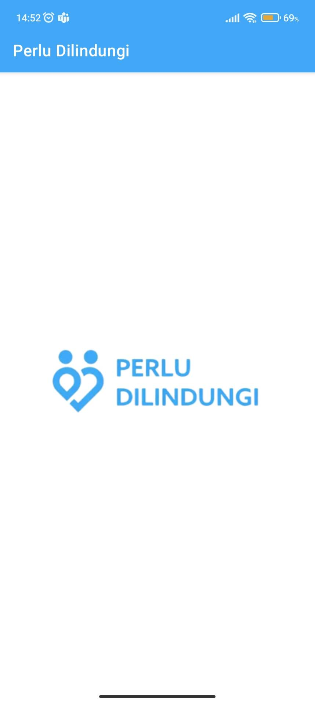
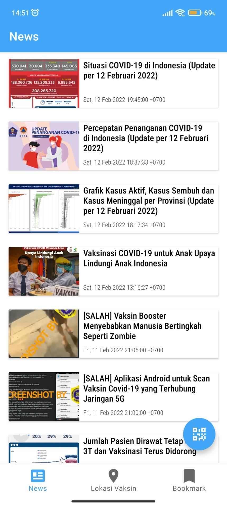
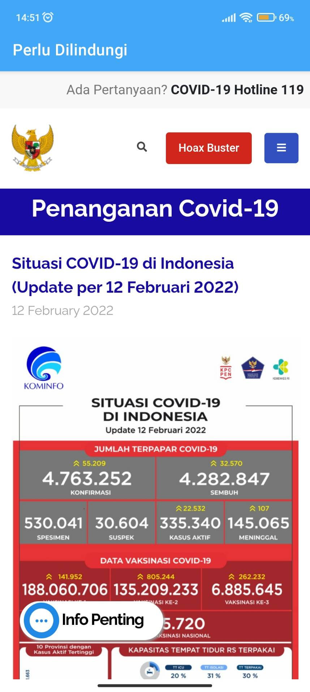
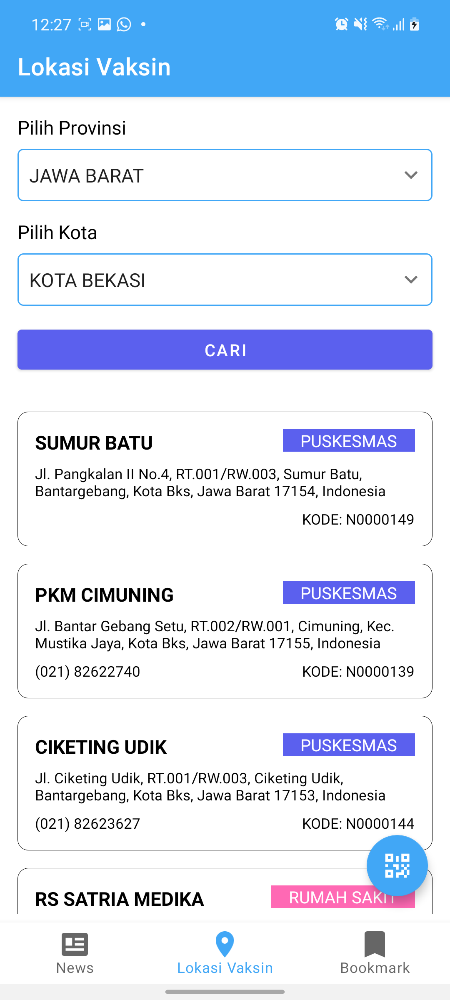
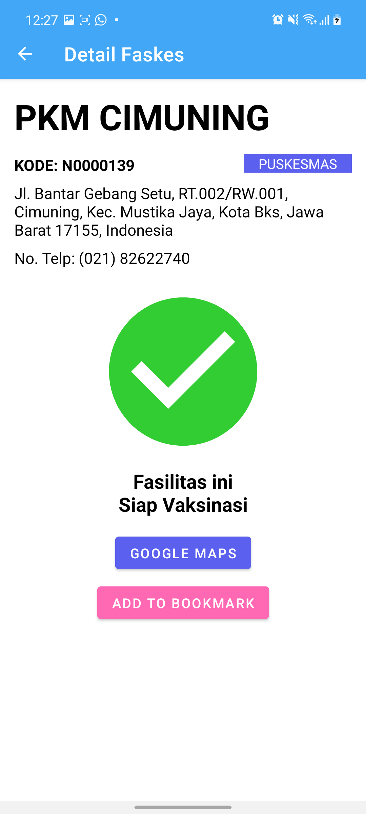
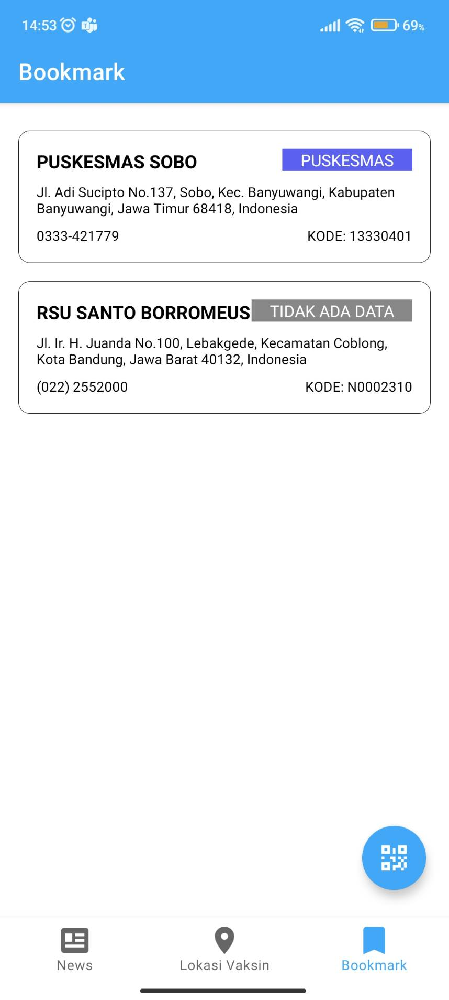
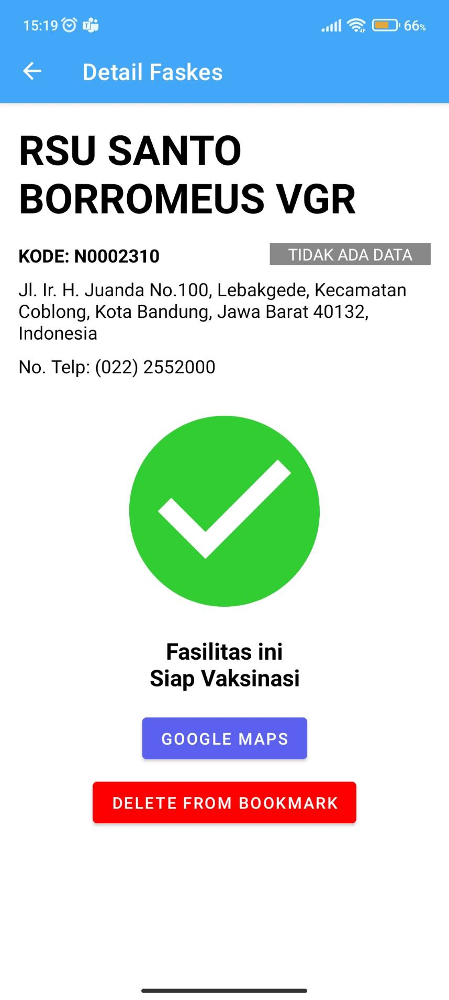
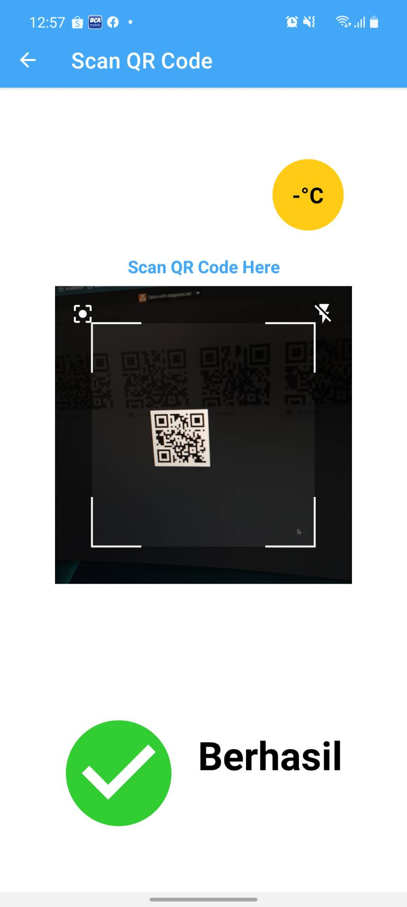
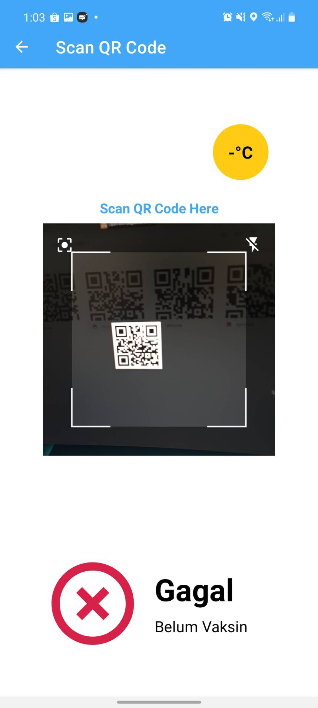
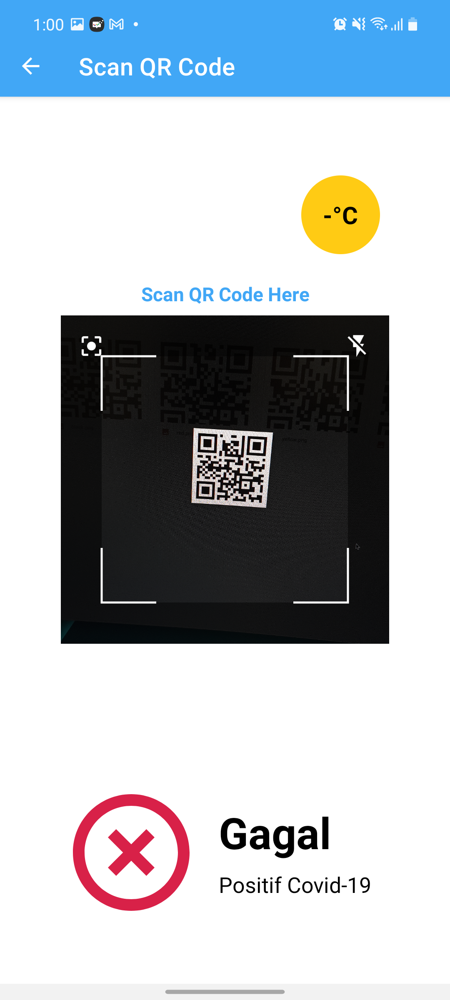

# Aplikasi Perlu Dilindungi

Tugas Besar 1 - Android
IF3210 Pengembangan Aplikasi pada Platform Khusus

## Deskripsi Aplikasi
Aplikasi Perlu Dilindungi adalah aplikasi mobile yang didalamnya terdapat beberapa fitur fungsional seperti:
1. Menampilkan berita COVID-19,
2. Menampilkan daftar faskes untuk vaksinasi,
3. Menampilkan detail informasi faskes,
4. Menampilkan daftar bookmark faskes,
5. Melakukan "Check-in",
6. Dan fitur-fitur tambahan lainnya

## Cara Kerja
Berikut adalah cara kerja aplikasi dalam pemenuhan spesifikasi fitur:
##### Menampilkan berita COVID-19
Berita COVID-19 dapat ditampilkan dengan menggunakan fragment. Di dalam fragment tersebut disusun layout yang berisi recycler view of news. News didapatkan dari API Perlu Dilindungi dengan cara melakukan hit pada directory /get-news/. Kemudian isi dari news ditampilkan menggunakan activity baru yang didalamnya terdapat layout webview sehingga jika card dari sebuah recycler view diklik, akan muncul isi dari berita layaknya di web.
##### Menampilkan daftar faskes untuk vaksinasi
Daftar faskes untuk vaksinasi ditampilkan dengan memanfaatkan fragment. Provinsi dan kota ditampilkan dalam bentuk dropdown menu yang diimplementasi menggunakan spinner. Kemudian, daftar faskes hasil pencarian ditampilkan dengan menggunakan recyclerView. Data provinsi, kota, dan pencarian faskes
didapat dengan mengakses API PerluDilindungi menggunakan Retrofit dan mengolah data JSON yang diterima ke dalam bentuk Kotlin data class. Fitur ini dibangun menggunakan pendekatan MVVM 
sehingga data tidak ter-reset ketika berpindah dari potrait layout ke landscape, dan sebaliknya. Fitur ini juga menerapkan responsive layout.
##### Menampilkan detail informasi faskes
Detail informasi faskes dipanggil ketika salah satu faskes dipilih dari daftar hasil pencarian. Data dari faskes yang dipilih dikirimkan dari MainActivity menuju FaskesDetailActivity menggunakan Intent. Data yang dikirimkan diimplementasi menggunakan Parcelable sehingga memudahkan komunikasi data antar activity.
##### Menampilkan daftar bookmark faskes
Bookmark Faskes diimplementasi dengan SQLite dan dikelola dengan library Room. Seluruh data yang terkait faskes yang ditambahkan ke dalam bookmark akan disimpan sehingga dapat diakses tanpa menggunakan internet.
Penyimpanan bookmark dilakukan dalam internal storage sehingga ketika aplikasi di-clear data atau diuninstall, maka daftar bookmark juga ikut terhapus.
##### Melakukan "Check-in"
Untuk melakukan check in, digunakan halaman QR Code Scanner yang akan tampil dengan menekan floating button QR Code pada bagian kanan bawah layar serta menggunakan Intent untuk berpindah halaman activity. Pengguna perlu memberikan izin untuk akses kamera sebelum melakukan scanning. Scanning dilakukan dengan mengarahkan kamera pada QR Code khusus. Setelah pembacaan kode selesai, string yang diperoleh dari QR Code beserta dengan informasi latitude dan longitude pengguna akan dikirimkan ke server Perlu Dilindungi. Setelah menerima response, aplikasi akan menampilkan hasil berdasarkan userStatus. Jika :
1. userStatus bernilai "black", maka akan ditampilkan hasil "Gagal" dan result "Positif Covid-19",
2. userStatus bernilai "red", maka akan ditampilkan hasil "Gagal" dan result "Belum Vaksin",
3. userStatus bernilai "yellow" atau "green", maka akan ditampilkan hasil "Berhasil".

Selain itu, pada halaman QR Code Scanner ini, terdapat informasi suhu kamar sekitar yang didapat menggunakan sensor temperatur di Android. Jika sensor temperatur tidak ditemukan, maka tampilan informasi suhu kamar secara default akan menjadi "-°C"

## Library
1. Android Material. Material digunakan untuk keperluan layouting dan membuat komponen-komponen di dalam layout menjadi lebih bagus dan cantik
2. Retrofit2. Retrofit2 digunakan ketika kita ingin melakukan hit kepada API yang kita tuju. API akan mengirim response kembali kepada aplikasi juga melalui Retrofit2 ini
3. Gson Converter. Library ini mempunyai fungsi untuk *overview*. Gson dapat mengubah Java Object menjadi representasi JSON, dan juga sebaliknya yaitu dari JSON menjadi Java Object
4. OkHttp Interceptor. Yaitu adalah sebuah interceptor yang membantu kita untuk melakukan log panggilan API kita. Interceptor seperti layaknya sebuah manager untuk API call yang membantu kami dalam memonitor hit API kami
5. Coil. Coil digunakan dalam menampilkan file gambar berekstensi .jpg atau .png yang file nya terdapat di website dengan URL bertipe string
6. Play Service Location. Library ini digunakan untuk mencari lokasi pengguna dimana sekarang dengan mengecek latitude dan longitude pengguna
7. Budiyev, Code Scanner. Library ini digunakan untuk melakukan scanning pada code qr yang nantinya digunakan pada proses "Check-in"

## Screenshot Aplikasi
### Landing Page

### News

### News Opened

### Lokasi Vaksin 

### Detail Faskes

### Bookmark

### Delete Bookmark

### Scan Berhasil

### Scan Gagal - Belum Vaksin

### Scan Gagal - Positif Covid

## Pembagian Kerja Kelompok
|NIM     |Nama                             |Pembagian Kerja
|--------|---------------------------------|----------------
|13519200|Muhammad Dehan Al Kautsar        |Menampilkan COVID-19 news dan web view news, floating button menuju scanning, dan tombol bottom navigate
|13519209|Wilson Tandya                    |Implementasi menampilkan lokasi vaksinasi dengan Google Maps dan activity Splash Start Screen
|13519218|Andres Jerriel Sinabutar         |Implementasi Room, database SQLite dan fragment bookmark faskes, dan fragment lokasi siap vaksinasi beserta implementasi location
|13519219|Raffi Fadhlurrahman Putra Rahiem |Intent Scanning QR code dan suhu
